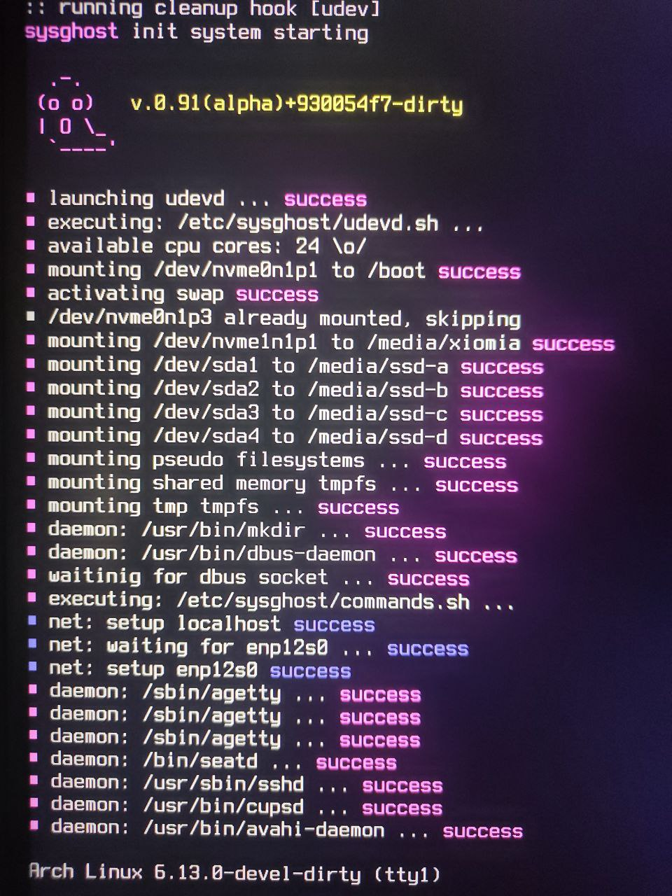

[](https://www.gnu.org/licenses/old-licenses/gpl-2.0.en.html)
[](https://github.com/spectrum70/badges/)
[](https://GitHub.com/spectrum70/sysghost/graphs/commit-activity)
[](https://github.com/spectrum70/sysghost/)
[](https://GitHub.com/spectrum70/sysghost/commit/)
[](https://GitHub.com/spectrum70/sysghost/issues/)
<br>
[](https://GitHub.com/spectrum70/sysghost/stargazers/)
[](https://GitHub.com/spectrum70/sysghost/network/)
[](https://github.com/spectrum70/sysghost?tab=followers)


<p align="center">
  
</p>


<p align="center"><b> A simple init system</b></p>

A **fast** and **easy to configure** init system, written in C with a very simple design, features kept at minimum, can be installed together with systemd.
```diff
! Note: versions < 1.00 are alpha, experimental, don't expect too much from them.
+ Note: without systemd, some comfortable features of your system will be missing.
```
(C) 2025 - Angelo Dureghello - kernelspace <angelo@kernel-space.org>

## Build
```
autoreconf -fi
./configure
make
sudo make install
```

## Usage

## Boot using sysghost
Just add sysghost to the kernel command line, as
```
"root=UUID=3d1c53ef-a4f0-4226-a87c-fb1ac155553b rw loglevel=14 audit=0 init=/usr/local/bin/sysghost"
```

<p align="center">
  
</p>

### Configuration
The sysghost init system uses some minimal scripts to setup system configuration. They are located in
```
ls -al /etc/sysghost
drwxr-xr-x   2 root root  4096 30 mar 20.41 .
drwxr-xr-x 144 root root 12288 30 mar 10.54 ..
-rwxr-xr-x   1 root root  1170 30 mar 20.49 commands.sh
-rw-r--r--   1 root root   210 24 mar 22.19 lib.sh
-rwxr-xr-x   1 root root   579 30 mar 10.32 udevd.sh
```
Check and customize them as needed.

### Device manager
By default, sysghost uses udevd (systemd-udevd) as a device manager, that is generally installed in the system. 
For this case, udevd.sh script is processed. As default, all devices should be added properly without
any change to the script.

### Services
Services are launched in src/launcher.c **lanucher_step_run_services()** function.
A small common set of services generally needed is launched ad default. Edit **src/launcher.c** and add or remove services as needed,
or eventually add them from command.sh.

### command.sh scripts
Add here whatever additional configuration to be performed at boot.

### Shutdown
```
sudo sysdown
```


